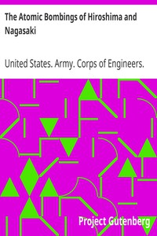

# The Atomic Bombings of Hiroshima and Nagasaki <kbd>685</kbd>

## Authors

 - United States. Army. Corps of Engineers. Manhattan District <small>(null - null)</small>

## Subjects

 - Atomic bomb -- Blast effect
 - Atomic bomb -- Physiological effect
 - Hiroshima-shi (Japan) -- History -- Bombardment, 1945
 - Nagasaki-shi (Japan) -- History -- Bombardment, 1945

## Download

 - https://www.gutenberg.org/cache/epub/685/pg685.cover.medium.jpg
 - https://www.gutenberg.org/files/685/685.txt
 - https://www.gutenberg.org/ebooks/685.html.images
 - https://www.gutenberg.org/ebooks/685.kindle.images
 - https://www.gutenberg.org/ebooks/685.txt.utf-8
 - https://www.gutenberg.org/ebooks/685.rdf
 - https://www.gutenberg.org/ebooks/685.epub.images

## Book Shelves

