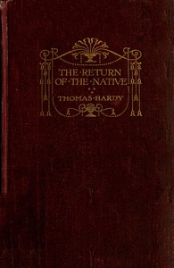

# The Return of the Native <kbd>122</kbd>

## Authors

 - Hardy, Thomas <small>(1840 - 1928)</small>

## Subjects

 - Adultery -- Fiction
 - Didactic fiction
 - Heathlands -- Fiction
 - Love stories
 - Mate selection -- Fiction
 - Mothers and sons -- Fiction
 - People with visual disabilities -- Fiction
 - Wessex (England) -- Fiction

## Download

 - https://www.gutenberg.org/files/122/122-0.zip
 - https://www.gutenberg.org/files/122/122-h.zip
 - https://www.gutenberg.org/cache/epub/122/pg122.cover.medium.jpg
 - https://www.gutenberg.org/files/122/122-0.txt
 - https://www.gutenberg.org/ebooks/122.html.images
 - https://www.gutenberg.org/ebooks/122.kindle.images
 - https://www.gutenberg.org/ebooks/122.rdf
 - https://www.gutenberg.org/ebooks/122.epub.images

## Book Shelves

