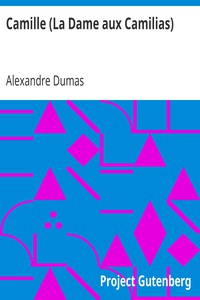

# Camille (La Dame aux Camilias) <kbd>1608</kbd>

## Authors

 - Dumas, Alexandre <small>(1824 - 1895)</small>

## Subjects

 - Courtesans -- Fiction
 - Fathers and sons -- Fiction
 - Love stories
 - Paris (France) -- Fiction
 - Tuberculosis -- Patients -- Fiction

## Download

 - https://www.gutenberg.org/cache/epub/1608/pg1608.cover.small.jpg
 - https://www.gutenberg.org/files/1608/1608-h.zip
 - https://www.gutenberg.org/files/1608/1608-0.txt
 - https://www.gutenberg.org/ebooks/1608.html.images
 - https://www.gutenberg.org/files/1608/1608-h/1608-h.htm
 - https://www.gutenberg.org/ebooks/1608.epub.images
 - https://www.gutenberg.org/ebooks/1608.rdf
 - https://www.gutenberg.org/ebooks/1608.kindle.images

## Book Shelves

