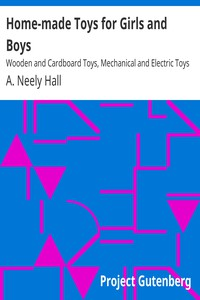

# Home-made Toys for Girls and Boys: Wooden and Cardboard Toys, Mechanical and Electric Toys <kbd>41669</kbd>

## Authors

 - Hall, A. Neely (Albert Neely) <small>(1883 - null)</small>

## Subjects

 - Handicraft
 - Toys

## Download

 - https://www.gutenberg.org/cache/epub/41669/pg41669.cover.small.jpg
 - https://www.gutenberg.org/files/41669/41669-8.txt
 - https://www.gutenberg.org/files/41669/41669.txt
 - https://www.gutenberg.org/files/41669/41669-h/41669-h.htm
 - https://www.gutenberg.org/ebooks/41669.html.images
 - https://www.gutenberg.org/ebooks/41669.kindle.images
 - https://www.gutenberg.org/ebooks/41669.txt.utf-8
 - https://www.gutenberg.org/ebooks/41669.rdf
 - https://www.gutenberg.org/ebooks/41669.epub.images

## Book Shelves

