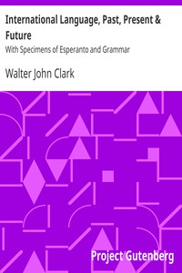

# International Language, Past, Present & Future: With Specimens of Esperanto and Grammar <kbd>16737</kbd>

## Authors

 - Clark, Walter John <small>(null - null)</small>

## Subjects

 - Esperanto -- Grammar
 - Language, Universal

## Download

 - https://www.gutenberg.org/files/16737/16737-0.txt
 - https://www.gutenberg.org/cache/epub/16737/pg16737.cover.medium.jpg
 - https://www.gutenberg.org/files/16737/16737-8.zip
 - https://www.gutenberg.org/files/16737/16737-h/16737-h.htm
 - https://www.gutenberg.org/ebooks/16737.html.images
 - https://www.gutenberg.org/ebooks/16737.epub.images
 - https://www.gutenberg.org/ebooks/16737.rdf
 - https://www.gutenberg.org/ebooks/16737.kindle.images

## Book Shelves

 - Esperanto
 - Language Education
