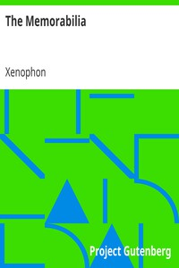

# The Memorabilia <kbd>1177</kbd>

## Authors

 - Xenophon <small>(-431 - -355)</small>

## Subjects

 - Classical literature
 - Philosophers, Ancient -- Biography -- Early works to 1800
 - Socrates -- Trials, litigation, etc. -- Early works to 1800

## Download

 - https://www.gutenberg.org/files/1177/1177.zip
 - https://www.gutenberg.org/cache/epub/1177/pg1177.cover.medium.jpg
 - https://www.gutenberg.org/files/1177/1177.txt
 - https://www.gutenberg.org/files/1177/1177-h/1177-h.htm
 - https://www.gutenberg.org/ebooks/1177.html.images
 - https://www.gutenberg.org/ebooks/1177.rdf
 - https://www.gutenberg.org/ebooks/1177.epub.images
 - https://www.gutenberg.org/ebooks/1177.kindle.images
 - https://www.gutenberg.org/ebooks/1177.txt.utf-8

## Book Shelves

