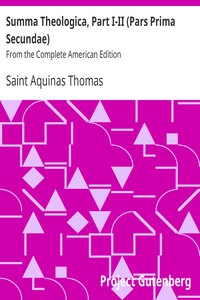

# Summa Theologica, Part I-II (Pars Prima Secundae): From the Complete American Edition <kbd>17897</kbd>

## Authors

 - Thomas, Aquinas, Saint <small>(null - 1274)</small>

## Subjects

 - Catholic Church -- Doctrines -- Early works to 1800
 - God -- Attributes -- Early works to 1800
 - God -- Omnipresence -- Early works to 1800
 - Theology, Doctrinal -- Early works to 1800

## Download

 - https://www.gutenberg.org/files/17897/17897.zip
 - https://www.gutenberg.org/cache/epub/17897/pg17897.cover.small.jpg
 - https://www.gutenberg.org/files/17897/17897.txt
 - https://www.gutenberg.org/ebooks/17897.txt.utf-8
 - https://www.gutenberg.org/ebooks/17897.epub.images
 - https://www.gutenberg.org/ebooks/17897.html.images
 - https://www.gutenberg.org/ebooks/17897.rdf
 - https://www.gutenberg.org/ebooks/17897.kindle.images

## Book Shelves

 - Christianity
