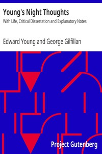

# Young's Night Thoughts: With Life, Critical Dissertation and Explanatory Notes <kbd>33156</kbd>

## Authors

 - Young, Edward <small>(1683 - 1765)</small>

## Subjects

 - Didactic poetry, English
 - English poetry

## Download

 - https://www.gutenberg.org/files/33156/33156-h.zip
 - https://www.gutenberg.org/files/33156/33156.zip
 - https://www.gutenberg.org/cache/epub/33156/pg33156.cover.medium.jpg
 - https://www.gutenberg.org/files/33156/33156-8.txt
 - https://www.gutenberg.org/ebooks/33156.html.images
 - https://www.gutenberg.org/ebooks/33156.txt.utf-8
 - https://www.gutenberg.org/ebooks/33156.epub.images
 - https://www.gutenberg.org/ebooks/33156.rdf
 - https://www.gutenberg.org/ebooks/33156.kindle.images

## Book Shelves

