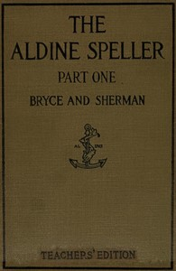

# The Aldine Speller: Part One, for Grades One and Two <kbd>67693</kbd>

## Authors

 - Bryce, Catherine T. (Catherine Turner) <small>(1871 - 1951)</small>
 - Sherman, Frank J. <small>(null - null)</small>

## Subjects

 - Spellers

## Download

 - https://www.gutenberg.org/ebooks/67693.rdf
 - https://www.gutenberg.org/ebooks/67693.epub.images
 - https://www.gutenberg.org/ebooks/67693.html.images
 - https://www.gutenberg.org/ebooks/67693.kindle.images
 - https://www.gutenberg.org/cache/epub/67693/pg67693.cover.medium.jpg
 - https://www.gutenberg.org/ebooks/67693.txt.utf-8
 - https://www.gutenberg.org/files/67693/67693-h.zip
 - https://www.gutenberg.org/files/67693/67693-0.txt
 - https://www.gutenberg.org/files/67693/67693-0.zip

## Book Shelves

