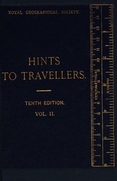

# Hints to Travellers, Scientific and General, Vol. 2: Tenth edition, revised and corrected <kbd>67668</kbd>

## Authors

 - Royal Geographical Society (Great Britain) <small>(null - null)</small>

## Subjects

 - Scientific expeditions -- Handbooks, manuals, etc.
 - Spherical astronomy
 - Topographical surveying

## Download

 - https://www.gutenberg.org/files/67668/67668-0.zip
 - https://www.gutenberg.org/ebooks/67668.rdf
 - https://www.gutenberg.org/ebooks/67668.html.images
 - https://www.gutenberg.org/files/67668/67668-h.zip
 - https://www.gutenberg.org/ebooks/67668.epub.images
 - https://www.gutenberg.org/ebooks/67668.txt.utf-8
 - https://www.gutenberg.org/ebooks/67668.kindle.images
 - https://www.gutenberg.org/cache/epub/67668/pg67668.cover.small.jpg
 - https://www.gutenberg.org/files/67668/67668-0.txt

## Book Shelves

