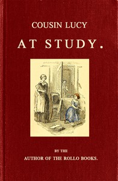

# Cousin Lucy at Study: By the Author of the Rollo Books <kbd>67601</kbd>

## Authors

 - Abbott, Jacob <small>(1803 - 1879)</small>

## Subjects

 - Brothers and sisters -- Juvenile fiction
 - Children with disabilities -- Juvenile fiction
 - Country life -- Juvenile fiction
 - Families -- Juvenile fiction
 - Money -- Juvenile fiction
 - Parent and child -- Juvenile fiction

## Download

 - https://www.gutenberg.org/files/67601/67601-0.zip
 - https://www.gutenberg.org/files/67601/67601-h.zip
 - https://www.gutenberg.org/cache/epub/67601/pg67601.cover.small.jpg
 - https://www.gutenberg.org/ebooks/67601.txt.utf-8
 - https://www.gutenberg.org/ebooks/67601.rdf
 - https://www.gutenberg.org/ebooks/67601.html.images
 - https://www.gutenberg.org/ebooks/67601.kindle.images
 - https://www.gutenberg.org/ebooks/67601.epub.images
 - https://www.gutenberg.org/files/67601/67601-0.txt

## Book Shelves

