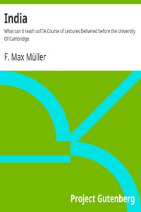

# India: What can it teach us?: A Course of Lectures Delivered before the University Of Cambridge <kbd>20847</kbd>

## Authors

 - Müller, F. Max (Friedrich Max) <small>(1823 - 1900)</small>

## Subjects

 - India
 - Sanskrit literature -- History and criticism
 - Vedas

## Download

 - https://www.gutenberg.org/files/20847/20847-8.txt
 - https://www.gutenberg.org/files/20847/20847-0.zip
 - https://www.gutenberg.org/cache/epub/20847/pg20847.cover.medium.jpg
 - https://www.gutenberg.org/files/20847/20847.txt
 - https://www.gutenberg.org/files/20847/20847-h.zip
 - https://www.gutenberg.org/files/20847/20847-h/20847-h.htm
 - https://www.gutenberg.org/ebooks/20847.html.images
 - https://www.gutenberg.org/ebooks/20847.epub.images
 - https://www.gutenberg.org/ebooks/20847.rdf
 - https://www.gutenberg.org/ebooks/20847.kindle.images

## Book Shelves

 - India
