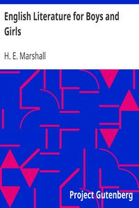

# English Literature for Boys and Girls <kbd>5725</kbd>

## Authors

 - Marshall, H. E. (Henrietta Elizabeth) <small>(1867 - 1941)</small>

## Subjects

 - English literature -- History and criticism

## Download

 - https://www.gutenberg.org/files/5725/5725-8.txt
 - https://www.gutenberg.org/files/5725/5725-8.zip
 - https://www.gutenberg.org/cache/epub/5725/pg5725.cover.small.jpg
 - https://www.gutenberg.org/ebooks/5725.kindle.images
 - https://www.gutenberg.org/ebooks/5725.rdf
 - https://www.gutenberg.org/ebooks/5725.html.images
 - https://www.gutenberg.org/ebooks/5725.epub.images
 - https://www.gutenberg.org/ebooks/5725.txt.utf-8

## Book Shelves

