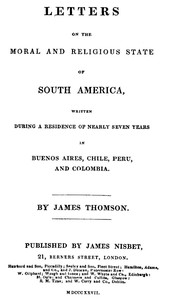

# Letters on the Moral and Religious State of South America: Written during a residence of nearly seven years in Buenos Aires, Chile, Peru and Colombia <kbd>67526</kbd>

## Authors

 - Thomson, James, D.D. <small>(null - null)</small>

## Subjects

 - Education -- South America
 - South America -- Description and travel
 - South America -- Religion
 - South America -- Social life and customs

## Download

 - https://www.gutenberg.org/ebooks/67526.txt.utf-8
 - https://www.gutenberg.org/ebooks/67526.epub.images
 - https://www.gutenberg.org/ebooks/67526.rdf
 - https://www.gutenberg.org/ebooks/67526.kindle.images
 - https://www.gutenberg.org/cache/epub/67526/pg67526.cover.small.jpg
 - https://www.gutenberg.org/files/67526/67526-h/67526-h.htm
 - https://www.gutenberg.org/files/67526/67526-h.zip
 - https://www.gutenberg.org/files/67526/67526-0.txt

## Book Shelves

