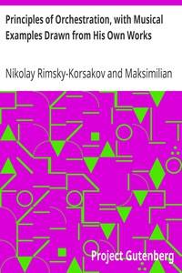

# Principles of Orchestration, with Musical Examples Drawn from His Own Works <kbd>33900</kbd>

## Authors

 - Rimsky-Korsakov, Nikolay <small>(1844 - 1908)</small>

## Subjects

 - Instrumentation and orchestration

## Download

 - https://www.gutenberg.org/files/33900/33900-h.zip
 - https://www.gutenberg.org/files/33900/33900-0.zip
 - https://www.gutenberg.org/cache/epub/33900/pg33900.cover.medium.jpg
 - https://www.gutenberg.org/files/33900/33900-h/33900-h.htm
 - https://www.gutenberg.org/ebooks/33900.html.images
 - https://www.gutenberg.org/ebooks/33900.kindle.images
 - https://www.gutenberg.org/ebooks/33900.rdf
 - https://www.gutenberg.org/ebooks/33900.epub.images

## Book Shelves

