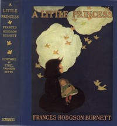

# A Little Princess: Being the whole story of Sara Crewe now told for the first time <kbd>37332</kbd>

## Authors

 - Burnett, Frances Hodgson <small>(1849 - 1924)</small>

## Subjects

 - Boarding schools -- Juvenile fiction
 - Girls -- Juvenile fiction
 - London (England) -- Juvenile fiction
 - Orphans -- Juvenile fiction
 - Schools -- Juvenile fiction

## Download

 - https://www.gutenberg.org/files/37332/37332-h.zip
 - https://www.gutenberg.org/cache/epub/37332/pg37332.cover.medium.jpg
 - https://www.gutenberg.org/files/37332/37332.txt
 - https://www.gutenberg.org/files/37332/37332-8.txt
 - https://www.gutenberg.org/files/37332/37332-h/37332-h.htm
 - https://www.gutenberg.org/ebooks/37332.html.images
 - https://www.gutenberg.org/ebooks/37332.rdf
 - https://www.gutenberg.org/ebooks/37332.epub.images
 - https://www.gutenberg.org/ebooks/37332.kindle.images
 - https://www.gutenberg.org/ebooks/37332.txt.utf-8

## Book Shelves

