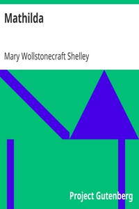

# Mathilda <kbd>15238</kbd>

## Authors

 - Shelley, Mary Wollstonecraft <small>(1797 - 1851)</small>

## Subjects

 - Fathers and daughters -- Fiction
 - Guilt -- Fiction
 - Incest -- Fiction

## Download

 - https://www.gutenberg.org/files/15238/15238-8.zip
 - https://www.gutenberg.org/files/15238/15238.txt
 - https://www.gutenberg.org/cache/epub/15238/pg15238.cover.medium.jpg
 - https://www.gutenberg.org/files/15238/15238-h.zip
 - https://www.gutenberg.org/ebooks/15238.html.images
 - https://www.gutenberg.org/ebooks/15238.txt.utf-8
 - https://www.gutenberg.org/ebooks/15238.epub.images
 - https://www.gutenberg.org/ebooks/15238.rdf
 - https://www.gutenberg.org/ebooks/15238.kindle.images
 - https://www.gutenberg.org/files/15238/15238-h/15238-h.htm

## Book Shelves

