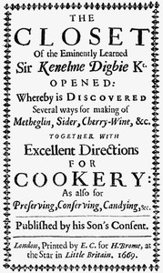

# The Closet of Sir Kenelm Digby Knight Opened <kbd>16441</kbd>

## Authors

 - Digby, Kenelm <small>(1603 - 1665)</small>

## Subjects

 - Cooking -- Early works to 1800
 - Digby, Kenelm, Sir, 1603-1665
 - Liquors
 - Wine and wine making -- Early works to 1800

## Download

 - https://www.gutenberg.org/cache/epub/16441/pg16441.cover.medium.jpg
 - https://www.gutenberg.org/files/16441/16441-h.zip
 - https://www.gutenberg.org/files/16441/16441-8.txt
 - https://www.gutenberg.org/files/16441/16441.txt
 - https://www.gutenberg.org/ebooks/16441.html.images
 - https://www.gutenberg.org/ebooks/16441.kindle.images
 - https://www.gutenberg.org/ebooks/16441.txt.utf-8
 - https://www.gutenberg.org/ebooks/16441.epub.images
 - https://www.gutenberg.org/ebooks/16441.rdf

## Book Shelves

 - Cookbooks and Cooking
 - Crafts
