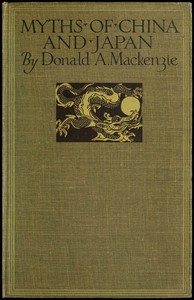

# Myths of China and Japan: with illustrations in colour & monochrome after paintings and photographs <kbd>67344</kbd>

## Authors

 - Mackenzie, Donald A. (Donald Alexander) <small>(1873 - 1936)</small>

## Subjects

 - China -- Civilization
 - Folklore -- China
 - Folklore -- Japan
 - Japan -- Civilization
 - Mythology, Chinese
 - Mythology, Japanese

## Download

 - https://www.gutenberg.org/cache/epub/67344/pg67344.cover.medium.jpg
 - https://www.gutenberg.org/ebooks/67344.kindle.images
 - https://www.gutenberg.org/ebooks/67344.rdf
 - https://www.gutenberg.org/files/67344/67344-h.zip
 - https://www.gutenberg.org/ebooks/67344.html.images
 - https://www.gutenberg.org/ebooks/67344.txt.utf-8
 - https://www.gutenberg.org/ebooks/67344.epub.images
 - https://www.gutenberg.org/files/67344/67344-0.txt

## Book Shelves

