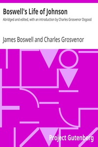

# Boswell's Life of Johnson: Abridged and edited, with an introduction by Charles Grosvenor Osgood <kbd>1564</kbd>

## Authors

 - Boswell, James <small>(1740 - 1795)</small>

## Subjects

 - Authors, English -- 18th century -- Biography
 - Critics -- Great Britain -- Biography
 - Johnson, Samuel, 1709-1784
 - Lexicographers -- Great Britain -- Biography

## Download

 - https://www.gutenberg.org/cache/epub/1564/pg1564.cover.medium.jpg
 - https://www.gutenberg.org/files/1564/1564.zip
 - https://www.gutenberg.org/files/1564/1564.txt
 - https://www.gutenberg.org/files/1564/1564-h.zip
 - https://www.gutenberg.org/ebooks/1564.html.images
 - https://www.gutenberg.org/ebooks/1564.rdf
 - https://www.gutenberg.org/ebooks/1564.epub.images
 - https://www.gutenberg.org/ebooks/1564.kindle.images
 - https://www.gutenberg.org/ebooks/1564.txt.utf-8

## Book Shelves

