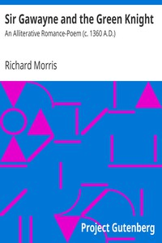

# Sir Gawayne and the Green Knight: An Alliterative Romance-Poem (c. 1360 A.D.) <kbd>14568</kbd>

## Authors

## Subjects

 - Arthurian romances
 - Gawain (Legendary character) -- Romances

## Download

 - https://www.gutenberg.org/cache/epub/14568/pg14568.cover.small.jpg
 - https://www.gutenberg.org/files/14568/14568-h.zip
 - https://www.gutenberg.org/files/14568/14568-0.txt
 - https://www.gutenberg.org/ebooks/14568.html.images
 - https://www.gutenberg.org/ebooks/14568.kindle.images
 - https://www.gutenberg.org/ebooks/14568.rdf
 - https://www.gutenberg.org/ebooks/14568.epub.images

## Book Shelves

 - Early English Text Society
 - Poetry
