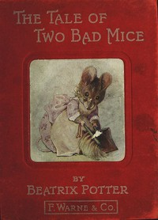

# The Tale of Two Bad Mice <kbd>45264</kbd>

## Authors

 - Potter, Beatrix <small>(1866 - 1943)</small>

## Subjects

 - Conduct of life -- Juvenile fiction
 - Dollhouses -- Juvenile fiction
 - Mice -- Juvenile fiction
 - Theft -- Juvenile fiction

## Download

 - https://www.gutenberg.org/files/45264/45264-h.zip
 - https://www.gutenberg.org/files/45264/45264-h/45264-h.htm
 - https://www.gutenberg.org/files/45264/45264.txt
 - https://www.gutenberg.org/cache/epub/45264/pg45264.cover.small.jpg
 - https://www.gutenberg.org/ebooks/45264.html.images
 - https://www.gutenberg.org/ebooks/45264.kindle.images
 - https://www.gutenberg.org/ebooks/45264.txt.utf-8
 - https://www.gutenberg.org/ebooks/45264.epub.images
 - https://www.gutenberg.org/ebooks/45264.rdf

## Book Shelves

