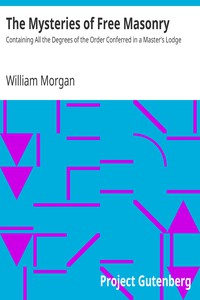

# The Mysteries of Free Masonry: Containing All the Degrees of the Order Conferred in a Master's Lodge <kbd>18136</kbd>

## Authors

 - Morgan, William <small>(1774 - null)</small>

## Subjects

 - Freemasonry -- United States -- Rituals

## Download

 - https://www.gutenberg.org/files/18136/18136-h.zip
 - https://www.gutenberg.org/cache/epub/18136/pg18136.cover.medium.jpg
 - https://www.gutenberg.org/files/18136/18136-8.zip
 - https://www.gutenberg.org/files/18136/18136-h/18136-h.htm
 - https://www.gutenberg.org/files/18136/18136.txt
 - https://www.gutenberg.org/ebooks/18136.html.images
 - https://www.gutenberg.org/ebooks/18136.txt.utf-8
 - https://www.gutenberg.org/ebooks/18136.epub.images
 - https://www.gutenberg.org/ebooks/18136.rdf
 - https://www.gutenberg.org/ebooks/18136.kindle.images

## Book Shelves

