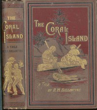

# The Coral Island: A Tale of the Pacific Ocean <kbd>646</kbd>

## Authors

 - Ballantyne, R. M. (Robert Michael) <small>(1825 - 1894)</small>

## Subjects

 - Camping -- Juvenile fiction
 - Conduct of life -- Juvenile fiction
 - Islands -- Juvenile fiction
 - Natural history -- Juvenile fiction
 - Oceania -- Juvenile fiction
 - Outdoor life -- Juvenile fiction
 - Pirates -- Juvenile fiction
 - Robinsonades
 - Shipwreck survival -- Juvenile fiction
 - Shipwrecks -- Juvenile fiction
 - Survival skills -- Juvenile fiction

## Download

 - https://www.gutenberg.org/files/646/646-0.zip
 - https://www.gutenberg.org/ebooks/646.html.images
 - https://www.gutenberg.org/cache/epub/646/pg646.cover.small.jpg
 - https://www.gutenberg.org/files/646/646-0.txt
 - https://www.gutenberg.org/ebooks/646.kindle.images
 - https://www.gutenberg.org/ebooks/646.txt.utf-8
 - https://www.gutenberg.org/ebooks/646.rdf
 - https://www.gutenberg.org/ebooks/646.epub.images

## Book Shelves

 - Children's Fiction
