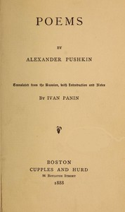

# Poems: With Introduction and Notes <kbd>54991</kbd>

## Authors

 - Pushkin, Aleksandr Sergeevich <small>(1799 - 1837)</small>

## Subjects

 - Russian poetry -- Translations into English

## Download

 - https://www.gutenberg.org/files/54991/54991-8.zip
 - https://www.gutenberg.org/cache/epub/54991/pg54991.cover.medium.jpg
 - https://www.gutenberg.org/files/54991/54991-h/54991-h.htm
 - https://www.gutenberg.org/ebooks/54991.html.images
 - https://www.gutenberg.org/ebooks/54991.rdf
 - https://www.gutenberg.org/ebooks/54991.kindle.images
 - https://www.gutenberg.org/ebooks/54991.epub.images
 - https://www.gutenberg.org/ebooks/54991.txt.utf-8

## Book Shelves

