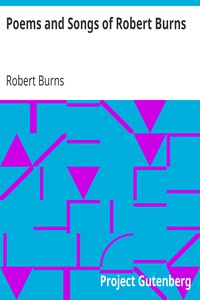

# Poems and Songs of Robert Burns <kbd>1279</kbd>

## Authors

 - Burns, Robert <small>(1759 - 1796)</small>

## Subjects

 - Scotland -- Poetry
 - Songs, Scots -- Scotland -- Texts

## Download

 - https://www.gutenberg.org/files/1279/1279.txt
 - https://www.gutenberg.org/files/1279/1279-0.zip
 - https://www.gutenberg.org/files/1279/1279-h/1279-h.htm
 - https://www.gutenberg.org/cache/epub/1279/pg1279.cover.small.jpg
 - https://www.gutenberg.org/ebooks/1279.html.images
 - https://www.gutenberg.org/files/1279/1279-0.txt
 - https://www.gutenberg.org/ebooks/1279.kindle.images
 - https://www.gutenberg.org/ebooks/1279.rdf
 - https://www.gutenberg.org/ebooks/1279.epub.images

## Book Shelves

 - Harvard Classics
