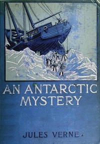

# An Antarctic Mystery <kbd>10339</kbd>

## Authors

 - Verne, Jules <small>(1828 - 1905)</small>

## Subjects

 - Antarctica -- Discovery and exploration -- Fiction

## Download

 - https://www.gutenberg.org/files/10339/10339-h.zip
 - https://www.gutenberg.org/files/10339/10339-h/10339-h.htm
 - https://www.gutenberg.org/cache/epub/10339/pg10339.cover.medium.jpg
 - https://www.gutenberg.org/files/10339/10339-0.txt
 - https://www.gutenberg.org/ebooks/10339.html.images
 - https://www.gutenberg.org/ebooks/10339.epub.images
 - https://www.gutenberg.org/ebooks/10339.kindle.images
 - https://www.gutenberg.org/ebooks/10339.rdf

## Book Shelves

