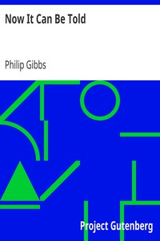

# Now It Can Be Told <kbd>3317</kbd>

## Authors

 - Gibbs, Philip <small>(1877 - 1962)</small>

## Subjects

 - World War, 1914-1918
 - World War, 1914-1918 -- Great Britain

## Download

 - https://www.gutenberg.org/files/3317/3317-0.txt
 - https://www.gutenberg.org/cache/epub/3317/pg3317.cover.small.jpg
 - https://www.gutenberg.org/files/3317/3317-8.zip
 - https://www.gutenberg.org/files/3317/3317-h/3317-h.htm
 - https://www.gutenberg.org/files/3317/3317-h.zip
 - https://www.gutenberg.org/ebooks/3317.html.images
 - https://www.gutenberg.org/files/3317/3317.txt
 - https://www.gutenberg.org/ebooks/3317.epub.images
 - https://www.gutenberg.org/ebooks/3317.kindle.images
 - https://www.gutenberg.org/ebooks/3317.rdf

## Book Shelves

 - Bestsellers, American, 1895-1923
 - World War I
