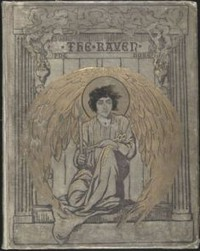

# The Raven <kbd>17192</kbd>

## Authors

 - Poe, Edgar Allan <small>(1809 - 1849)</small>

## Subjects

 - Fantasy poetry, American
 - Ravens -- Poetry

## Download

 - https://www.gutenberg.org/files/17192/17192-h.zip
 - https://www.gutenberg.org/cache/epub/17192/pg17192.cover.medium.jpg
 - https://www.gutenberg.org/files/17192/17192-h/17192-h.htm
 - https://www.gutenberg.org/files/17192/17192.txt
 - https://www.gutenberg.org/files/17192/17192-8.txt
 - https://www.gutenberg.org/ebooks/17192.html.images
 - https://www.gutenberg.org/ebooks/17192.txt.utf-8
 - https://www.gutenberg.org/ebooks/17192.epub.images
 - https://www.gutenberg.org/ebooks/17192.rdf
 - https://www.gutenberg.org/ebooks/17192.kindle.images

## Book Shelves

 - Bibliomania
