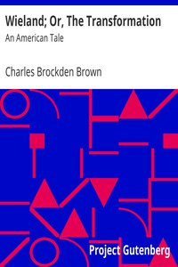

# Wieland; Or, The Transformation: An American Tale <kbd>792</kbd>

## Authors

 - Brown, Charles Brockden <small>(1771 - 1810)</small>

## Subjects

 - Brothers and sisters -- Fiction
 - Combustion, Spontaneous -- Fiction
 - Epistolary fiction
 - Fathers -- Death -- Fiction
 - Gothic fiction
 - Horror tales
 - Pennsylvania -- History -- Colonial period, ca. 1600-1775 -- Fiction
 - Psychological fiction
 - Radicals -- Fiction
 - Religious fanaticism -- Fiction

## Download

 - https://www.gutenberg.org/files/792/792.zip
 - https://www.gutenberg.org/files/792/792-h.zip
 - https://www.gutenberg.org/cache/epub/792/pg792.cover.small.jpg
 - https://www.gutenberg.org/files/792/792.txt
 - https://www.gutenberg.org/ebooks/792.html.images
 - https://www.gutenberg.org/ebooks/792.kindle.images
 - https://www.gutenberg.org/ebooks/792.txt.utf-8
 - https://www.gutenberg.org/ebooks/792.rdf
 - https://www.gutenberg.org/ebooks/792.epub.images

## Book Shelves

 - Best Books Ever Listings
 - Gothic Fiction
