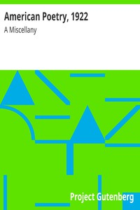

# American Poetry, 1922: A Miscellany <kbd>25880</kbd>

## Authors

## Subjects

 - American poetry -- 20th century

## Download

 - https://www.gutenberg.org/files/25880/25880-h/25880-h.htm
 - https://www.gutenberg.org/cache/epub/25880/pg25880.cover.small.jpg
 - https://www.gutenberg.org/files/25880/25880-h.zip
 - https://www.gutenberg.org/files/25880/25880-8.txt
 - https://www.gutenberg.org/ebooks/25880.html.images
 - https://www.gutenberg.org/files/25880/25880.txt
 - https://www.gutenberg.org/ebooks/25880.kindle.images
 - https://www.gutenberg.org/ebooks/25880.txt.utf-8
 - https://www.gutenberg.org/ebooks/25880.epub.images
 - https://www.gutenberg.org/ebooks/25880.rdf

## Book Shelves

