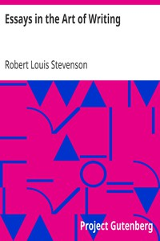

# Essays in the Art of Writing <kbd>492</kbd>

## Authors

 - Stevenson, Robert Louis <small>(1850 - 1894)</small>

## Subjects

 - Authorship
 - Literature -- History and criticism
 - Stevenson, Robert Louis, 1850-1894 -- Authorship

## Download

 - https://www.gutenberg.org/files/492/492-0.zip
 - https://www.gutenberg.org/files/492/492-h.zip
 - https://www.gutenberg.org/cache/epub/492/pg492.cover.medium.jpg
 - https://www.gutenberg.org/files/492/492-0.txt
 - https://www.gutenberg.org/ebooks/492.kindle.images
 - https://www.gutenberg.org/ebooks/492.rdf
 - https://www.gutenberg.org/ebooks/492.epub.images

## Book Shelves

