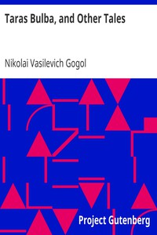

# Taras Bulba, and Other Tales <kbd>1197</kbd>

## Authors

 - Gogol, Nikolai Vasilevich <small>(1809 - 1852)</small>

## Subjects

 - Russia -- Fiction
 - Short stories

## Download

 - https://www.gutenberg.org/cache/epub/1197/pg1197.cover.medium.jpg
 - https://www.gutenberg.org/files/1197/1197-0.txt
 - https://www.gutenberg.org/files/1197/1197.txt
 - https://www.gutenberg.org/files/1197/1197-0.zip
 - https://www.gutenberg.org/files/1197/1197-h/1197-h.htm
 - https://www.gutenberg.org/ebooks/1197.html.images
 - https://www.gutenberg.org/ebooks/1197.rdf
 - https://www.gutenberg.org/ebooks/1197.epub.images
 - https://www.gutenberg.org/ebooks/1197.kindle.images

## Book Shelves

