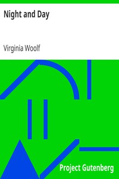

# Night and Day <kbd>1245</kbd>

## Authors

 - Woolf, Virginia <small>(1882 - 1941)</small>

## Subjects

 - Biographers -- Fiction
 - Domestic fiction
 - London (England) -- Fiction
 - Love stories
 - Mothers and daughters -- Fiction
 - Poets -- Family relationships -- Fiction
 - Triangles (Interpersonal relations) -- Fiction
 - Young women -- Fiction

## Download

 - https://www.gutenberg.org/files/1245/1245-0.txt
 - https://www.gutenberg.org/files/1245/1245-h.zip
 - https://www.gutenberg.org/cache/epub/1245/pg1245.cover.medium.jpg
 - https://www.gutenberg.org/files/1245/1245-h/1245-h.htm
 - https://www.gutenberg.org/ebooks/1245.html.images
 - https://www.gutenberg.org/ebooks/1245.rdf
 - https://www.gutenberg.org/ebooks/1245.epub.images
 - https://www.gutenberg.org/ebooks/1245.kindle.images

## Book Shelves

