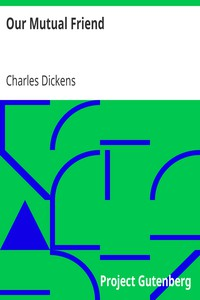

# Our Mutual Friend <kbd>883</kbd>

## Authors

 - Dickens, Charles <small>(1812 - 1870)</small>

## Subjects

 - Deception -- Fiction
 - Inheritance and succession -- Fiction
 - London (England) -- Fiction
 - Love stories
 - Poor families -- Fiction
 - Satire
 - Social classes -- Fiction

## Download

 - https://www.gutenberg.org/files/883/883-0.zip
 - https://www.gutenberg.org/cache/epub/883/pg883.cover.small.jpg
 - https://www.gutenberg.org/files/883/883-h.zip
 - https://www.gutenberg.org/files/883/883-h/883-h.htm
 - https://www.gutenberg.org/ebooks/883.html.images
 - https://www.gutenberg.org/ebooks/883.kindle.images
 - https://www.gutenberg.org/ebooks/883.rdf
 - https://www.gutenberg.org/ebooks/883.epub.images

## Book Shelves

