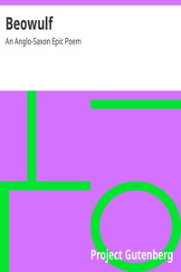

# Beowulf: An Anglo-Saxon Epic Poem <kbd>16328</kbd>

## Authors

## Subjects

 - Dragons -- Poetry
 - Epic poetry, English (Old)
 - Monsters -- Poetry

## Download

 - https://www.gutenberg.org/files/16328/16328-0.zip
 - https://www.gutenberg.org/cache/epub/16328/pg16328.cover.small.jpg
 - https://www.gutenberg.org/files/16328/16328-h/16328-h.htm
 - https://www.gutenberg.org/ebooks/16328.html.images
 - https://www.gutenberg.org/ebooks/16328.rdf
 - https://www.gutenberg.org/ebooks/16328.epub.images
 - https://www.gutenberg.org/ebooks/16328.kindle.images

## Book Shelves

 - Poetry
