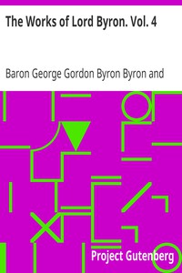

# The Works of Lord Byron. Vol. 4 <kbd>20158</kbd>

## Authors

 - Byron, George Gordon Byron, Baron <small>(1788 - 1824)</small>

## Subjects

 - Poetry

## Download

 - https://www.gutenberg.org/cache/epub/20158/pg20158.cover.medium.jpg
 - https://www.gutenberg.org/files/20158/20158-0.txt
 - https://www.gutenberg.org/files/20158/20158-h.zip
 - https://www.gutenberg.org/files/20158/20158-8.txt
 - https://www.gutenberg.org/files/20158/20158.zip
 - https://www.gutenberg.org/files/20158/20158.txt
 - https://www.gutenberg.org/ebooks/20158.epub.images
 - https://www.gutenberg.org/ebooks/20158.rdf
 - https://www.gutenberg.org/ebooks/20158.kindle.images

## Book Shelves

 - Harvard Classics
 - Poetry
