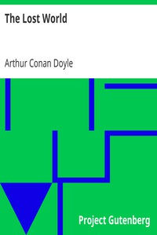

# The Lost World <kbd>139</kbd>

## Authors

 - Doyle, Arthur Conan <small>(1859 - 1930)</small>

## Subjects

 - Challenger, Professor (Fictitious character) -- Fiction
 - Dinosaurs -- Fiction
 - Fantasy fiction
 - Prehistoric peoples -- Fiction
 - South America -- Fiction

## Download

 - https://www.gutenberg.org/cache/epub/139/pg139.cover.small.jpg
 - https://www.gutenberg.org/files/139/139-h/139-h.htm
 - https://www.gutenberg.org/files/139/139.txt
 - https://www.gutenberg.org/ebooks/139.html.images
 - https://www.gutenberg.org/ebooks/139.kindle.images
 - https://www.gutenberg.org/ebooks/139.txt.utf-8
 - https://www.gutenberg.org/ebooks/139.rdf
 - https://www.gutenberg.org/ebooks/139.epub.images

## Book Shelves

 - Science Fiction
