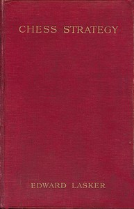

# Chess Strategy <kbd>5614</kbd>

## Authors

 - Lasker, Edward <small>(1885 - 1981)</small>

## Subjects

 - Chess

## Download

 - https://www.gutenberg.org/files/5614/5614-0.txt
 - https://www.gutenberg.org/ebooks/5614.html.images
 - https://www.gutenberg.org/cache/epub/5614/pg5614.cover.small.jpg
 - https://www.gutenberg.org/files/5614/5614-h.zip
 - https://www.gutenberg.org/ebooks/5614.kindle.images
 - https://www.gutenberg.org/ebooks/5614.epub.images
 - https://www.gutenberg.org/ebooks/5614.rdf

## Book Shelves

