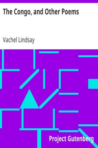

# The Congo, and Other Poems <kbd>1021</kbd>

## Authors

 - Lindsay, Vachel <small>(1879 - 1931)</small>

## Subjects

 - American poetry
 - Narrative poetry

## Download

 - https://www.gutenberg.org/cache/epub/1021/pg1021.cover.small.jpg
 - https://www.gutenberg.org/files/1021/1021.zip
 - https://www.gutenberg.org/ebooks/1021.html.images
 - https://www.gutenberg.org/files/1021/1021-h/1021-h.htm
 - https://www.gutenberg.org/ebooks/1021.rdf
 - https://www.gutenberg.org/ebooks/1021.epub.images
 - https://www.gutenberg.org/ebooks/1021.kindle.images
 - https://www.gutenberg.org/ebooks/1021.txt.utf-8

## Book Shelves

