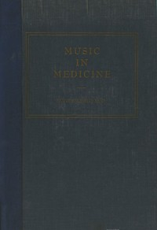

# Music in Medicine <kbd>67545</kbd>

## Authors

 - Licht, Sidney <small>(1907 - 1979)</small>

## Subjects

 - Music -- Physiological effect
 - Music, Influence of

## Download

 - https://www.gutenberg.org/ebooks/67545.txt.utf-8
 - https://www.gutenberg.org/ebooks/67545.rdf
 - https://www.gutenberg.org/cache/epub/67545/pg67545.cover.small.jpg
 - https://www.gutenberg.org/ebooks/67545.epub.images
 - https://www.gutenberg.org/ebooks/67545.kindle.images
 - https://www.gutenberg.org/files/67545/67545-0.txt
 - https://www.gutenberg.org/files/67545/67545-h/67545-h.htm
 - https://www.gutenberg.org/files/67545/67545-h.zip

## Book Shelves

