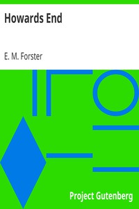

# Howards End <kbd>2946</kbd>

## Authors

 - Forster, E. M. (Edward Morgan) <small>(1879 - 1970)</small>

## Subjects

 - Country homes -- Fiction
 - Domestic fiction
 - England -- Fiction
 - Illegitimate children -- Fiction
 - Inheritance and succession -- Fiction
 - Remarried people -- Fiction
 - Sisters -- Fiction
 - Social classes -- Fiction

## Download

 - https://www.gutenberg.org/files/2946/2946-h.zip
 - https://www.gutenberg.org/files/2946/2946-0.zip
 - https://www.gutenberg.org/cache/epub/2946/pg2946.cover.medium.jpg
 - https://www.gutenberg.org/ebooks/2946.html.images
 - https://www.gutenberg.org/ebooks/2946.rdf
 - https://www.gutenberg.org/ebooks/2946.epub.images
 - https://www.gutenberg.org/ebooks/2946.kindle.images

## Book Shelves

