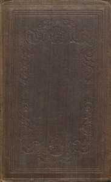

# The Useful Arts Employed in the Construction of Dwelling Houses. Second Edition <kbd>67636</kbd>

## Authors

 - Anonymous <small>(null - null)</small>

## Subjects

 - Architecture, Domestic
 - Building materials
 - Dwellings -- Design and construction

## Download

 - https://www.gutenberg.org/files/67636/67636-h/67636-h.htm
 - https://www.gutenberg.org/ebooks/67636.epub.images
 - https://www.gutenberg.org/files/67636/67636-0.zip
 - https://www.gutenberg.org/ebooks/67636.rdf
 - https://www.gutenberg.org/ebooks/67636.kindle.images
 - https://www.gutenberg.org/ebooks/67636.txt.utf-8
 - https://www.gutenberg.org/files/67636/67636-h.zip
 - https://www.gutenberg.org/cache/epub/67636/pg67636.cover.small.jpg
 - https://www.gutenberg.org/files/67636/67636-0.txt

## Book Shelves

