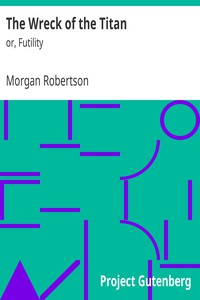

# The Wreck of the Titan: or, Futility <kbd>24880</kbd>

## Authors

 - Robertson, Morgan <small>(1861 - 1915)</small>

## Subjects

 - Sea stories, American
 - Ships -- Fiction
 - Shipwrecks -- Fiction

## Download

 - https://www.gutenberg.org/files/24880/24880-h/24880-h.htm
 - https://www.gutenberg.org/cache/epub/24880/pg24880.cover.small.jpg
 - https://www.gutenberg.org/files/24880/24880.zip
 - https://www.gutenberg.org/files/24880/24880-8.txt
 - https://www.gutenberg.org/files/24880/24880.txt
 - https://www.gutenberg.org/ebooks/24880.html.images
 - https://www.gutenberg.org/ebooks/24880.kindle.images
 - https://www.gutenberg.org/ebooks/24880.rdf
 - https://www.gutenberg.org/ebooks/24880.epub.images
 - https://www.gutenberg.org/ebooks/24880.txt.utf-8

## Book Shelves

