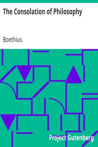

# The Consolation of Philosophy <kbd>14328</kbd>

## Authors

 - Boethius <small>(480 - 524)</small>

## Subjects

 - Happiness
 - Philosophy and religion

## Download

 - https://www.gutenberg.org/files/14328/14328-h/14328-h.htm
 - https://www.gutenberg.org/files/14328/14328.txt
 - https://www.gutenberg.org/files/14328/14328-h.zip
 - https://www.gutenberg.org/cache/epub/14328/pg14328.cover.medium.jpg
 - https://www.gutenberg.org/files/14328/14328-8.zip
 - https://www.gutenberg.org/ebooks/14328.html.images
 - https://www.gutenberg.org/ebooks/14328.txt.utf-8
 - https://www.gutenberg.org/ebooks/14328.epub.images
 - https://www.gutenberg.org/ebooks/14328.kindle.images
 - https://www.gutenberg.org/ebooks/14328.rdf

## Book Shelves

 - Classical Antiquity
