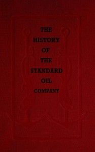

# The History of the Standard Oil Company <kbd>60692</kbd>

## Authors

 - Tarbell, Ida M. (Ida Minerva) <small>(1857 - 1944)</small>

## Subjects

 - Petroleum industry and trade -- United States -- History
 - Standard Oil Company -- History

## Download

 - https://www.gutenberg.org/files/60692/60692-0.txt
 - https://www.gutenberg.org/files/60692/60692-h.zip
 - https://www.gutenberg.org/cache/epub/60692/pg60692.cover.medium.jpg
 - https://www.gutenberg.org/files/60692/60692-h/60692-h.htm
 - https://www.gutenberg.org/ebooks/60692.html.images
 - https://www.gutenberg.org/ebooks/60692.epub.images
 - https://www.gutenberg.org/ebooks/60692.rdf
 - https://www.gutenberg.org/ebooks/60692.kindle.images

## Book Shelves

