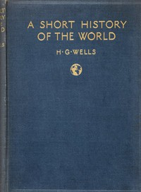

# A Short History of the World <kbd>35461</kbd>

## Authors

 - Wells, H. G. (Herbert George) <small>(1866 - 1946)</small>

## Subjects

 - World history

## Download

 - https://www.gutenberg.org/files/35461/35461-h.zip
 - https://www.gutenberg.org/cache/epub/35461/pg35461.cover.small.jpg
 - https://www.gutenberg.org/ebooks/35461.html.images
 - https://www.gutenberg.org/ebooks/35461.txt.utf-8
 - https://www.gutenberg.org/files/35461/35461-0.txt
 - https://www.gutenberg.org/ebooks/35461.kindle.images
 - https://www.gutenberg.org/ebooks/35461.rdf
 - https://www.gutenberg.org/ebooks/35461.epub.images

## Book Shelves

