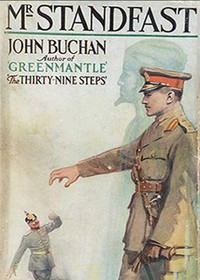

# Mr. Standfast <kbd>560</kbd>

## Authors

 - Buchan, John <small>(1875 - 1940)</small>

## Subjects

 - Hannay, Richard (Fictitious character) -- Fiction
 - Intelligence service -- Great Britain -- Fiction
 - Spy stories
 - War stories
 - World War, 1914-1918 -- Fiction

## Download

 - https://www.gutenberg.org/files/560/560-0.zip
 - https://www.gutenberg.org/files/560/560-h.zip
 - https://www.gutenberg.org/cache/epub/560/pg560.cover.small.jpg
 - https://www.gutenberg.org/files/560/560-0.txt
 - https://www.gutenberg.org/files/560/560.txt
 - https://www.gutenberg.org/ebooks/560.html.images
 - https://www.gutenberg.org/ebooks/560.kindle.images
 - https://www.gutenberg.org/ebooks/560.rdf
 - https://www.gutenberg.org/ebooks/560.epub.images

## Book Shelves

 - Adventure
 - Contemporary Reviews
 - Movie Books
 - World War I
