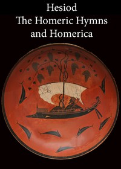

# Hesiod, the Homeric Hymns, and Homerica <kbd>348</kbd>

## Authors

 - Hesiod <small>(null - null)</small>

## Subjects

 - Epic poetry, Greek
 - Epic poetry, Greek -- Translations into English
 - Gods, Greek -- Poetry
 - Hesiod -- Translations into English
 - Hymns, Greek (Classical) -- Translations into English

## Download

 - https://www.gutenberg.org/cache/epub/348/pg348.cover.medium.jpg
 - https://www.gutenberg.org/files/348/348-0.zip
 - https://www.gutenberg.org/files/348/348.txt
 - https://www.gutenberg.org/ebooks/348.html.images
 - https://www.gutenberg.org/ebooks/348.kindle.images
 - https://www.gutenberg.org/files/348/348-h/348-h.htm
 - https://www.gutenberg.org/ebooks/348.rdf
 - https://www.gutenberg.org/ebooks/348.epub.images

## Book Shelves

 - Classical Antiquity
