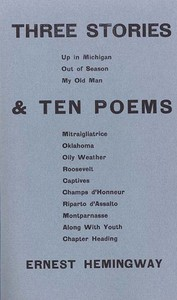

# Three Stories & Ten Poems <kbd>59603</kbd>

## Authors

 - Hemingway, Ernest <small>(1899 - 1961)</small>

## Subjects

 - American fiction -- 20th century
 - American poetry -- 20th century
 - Short stories, American

## Download

 - https://www.gutenberg.org/files/59603/59603-0.txt
 - https://www.gutenberg.org/cache/epub/59603/pg59603.cover.small.jpg
 - https://www.gutenberg.org/files/59603/59603-h.zip
 - https://www.gutenberg.org/files/59603/59603-h/59603-h.htm
 - https://www.gutenberg.org/ebooks/59603.html.images
 - https://www.gutenberg.org/ebooks/59603.kindle.images
 - https://www.gutenberg.org/ebooks/59603.rdf
 - https://www.gutenberg.org/ebooks/59603.epub.images

## Book Shelves

